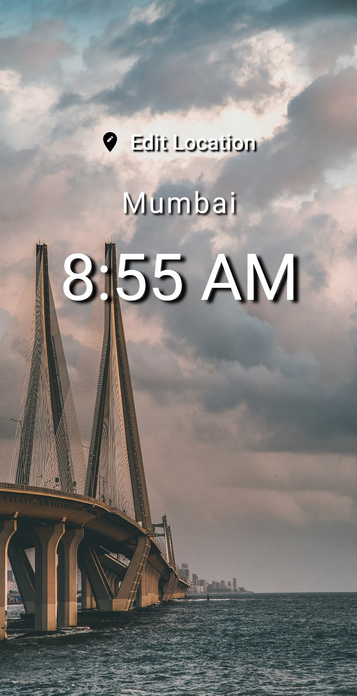
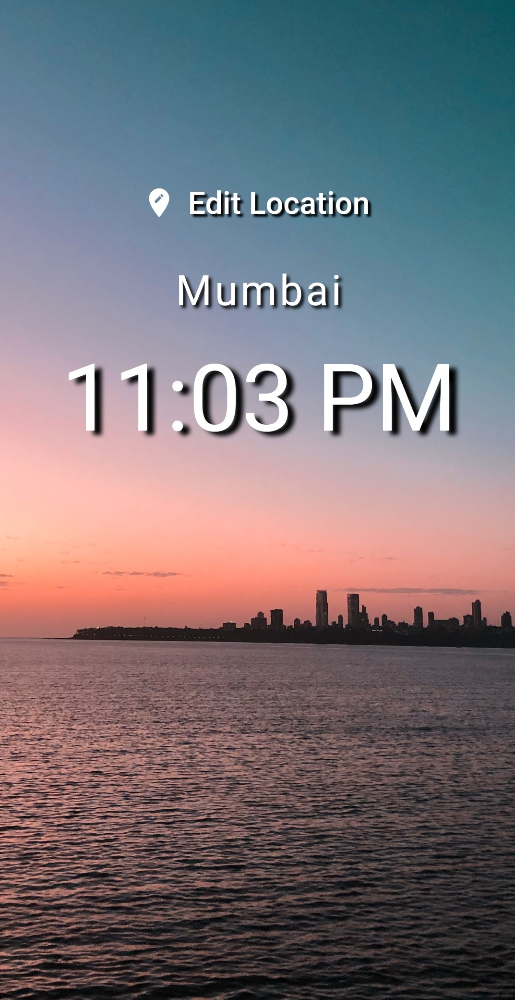
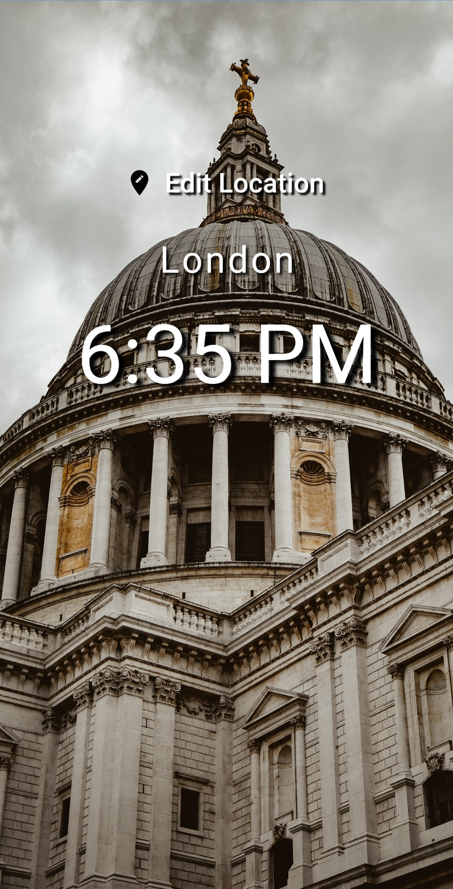
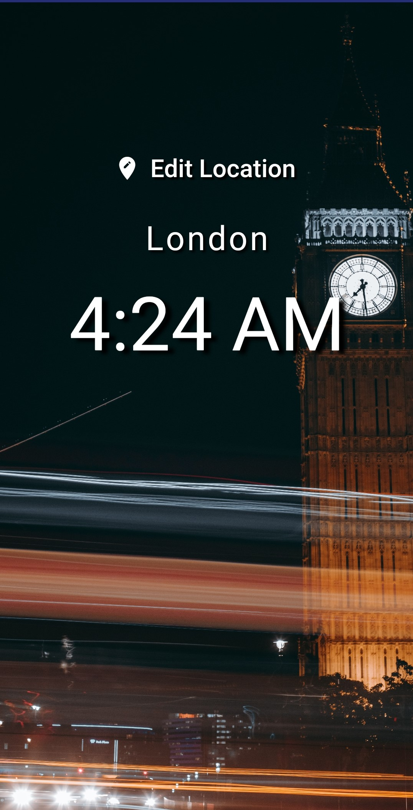
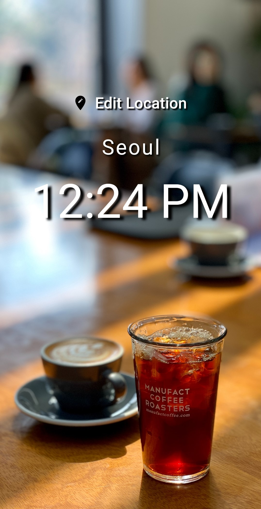
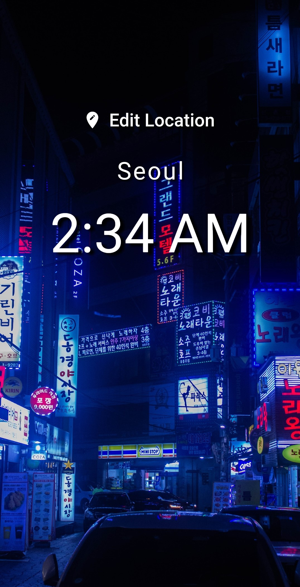
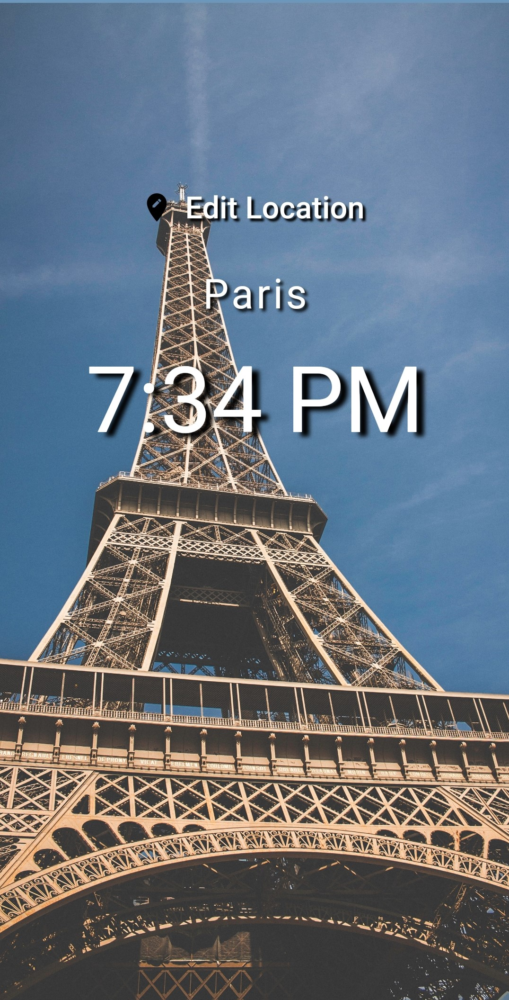
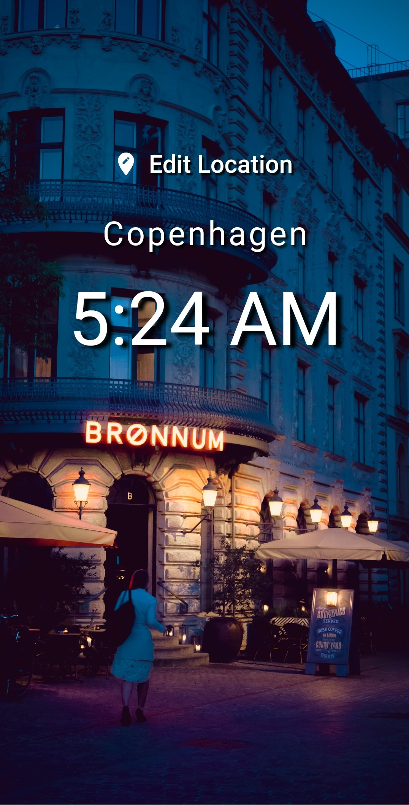

# Worldtime Display 🕰️

*A new Flutter application using World Time API* 

## 🎯 Motto 

This application displays time and city according to the user's selection which is the base version made by [NetNinja](https://github.com/iamshaunjp/flutter-beginners-tutorial). However here I have displayed backgrounds according to the city selected by the user and also the backgrounds are distinct for day time and night time **(which is past 20:00)**

## 🔺 Scale

Although the current cities, URLs, and images and statically included as a list to display this can further be done by using a cloud storage combined with a database to make it completely dynamic.

## 📸 Screenshots

Mumbai Day             |  Mumbai Night
:-------------------------:|:-------------------------:
  |  

London Day             |  London Night
:-------------------------:|:-------------------------:
  |  

Seoul Day             |  Seoul Night
:-------------------------:|:-------------------------:
  |  

Paris Day             |  Copenhagen Night
:-------------------------:|:-------------------------:
  |  

## ✏️ Changes

Feel free to fork it or create a pull request if you can make it more efficient.

## 📎 Images

Photos taken from [Unsplash](https://unsplash.com/)

